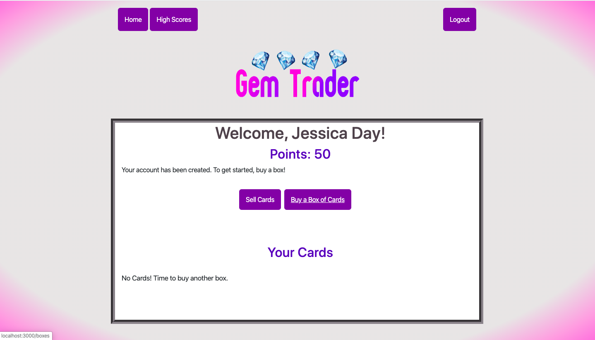

# Gem Trader
## by Ariel Davis and Laura Archambault

Gem Trader is a simple game for collecting and selling cards. Cards are themed with various gems. A player can buy a box of cards and hope for the rarest, most highly-valued gem cards. 

Buy and sell to build your collection and try to land on the leaderboard.

## To play this game:

* computer prereq's: Ruby, SQLite3, and Rails

* fork and clone the github repo: https://github.com/laarchambault/gem_trader

* cd into the app in your terminal and run `bundle install`

* run the rails command `rails server` to serve the game on your computer

* navigate to http:/localhost:3000 to play

## Demo
While this code is not in production stage, you can see the demo here: https://youtu.be/GNFE0givTTA

## About the Developers
Ariel Davis and Laura Archambault created this app while students at Flatiron School, Atlanta campus. The project assignment was to create a Rails application, both front- and backend using 5 models. Students were to demonstrate an understanding of ActiveRecord and the MVC pattern.

We are excited to showcase this project after just six weeks of instruction. Building on the instruction we received in class, we self-taught rudimentary probability, CSS, and a few complex Ruby/HTML operators.

